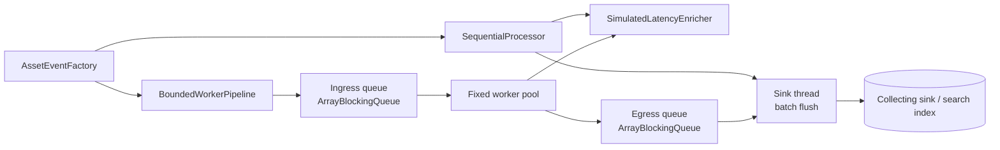
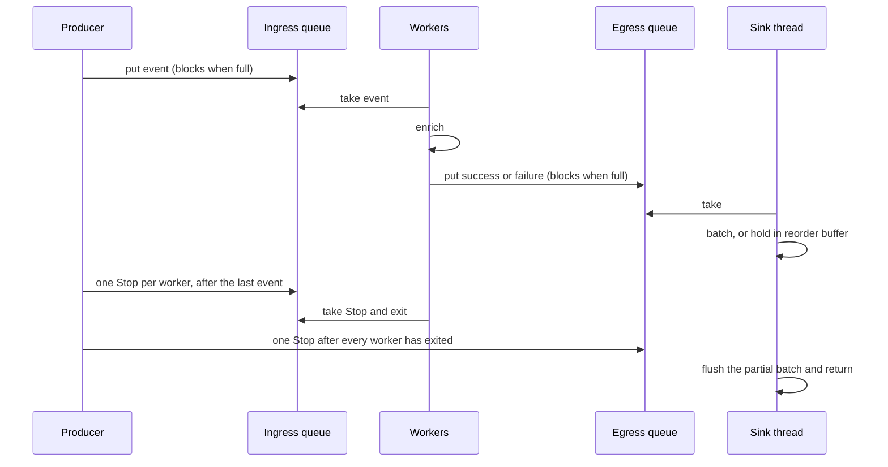

# Architecture

The metadata sync is a batch of asset-change events. Each event is enriched (classification, owner, lineage) and then written to a sink in batches. Enrichment is the slow step: it models a blocking call to a metadata service. The sink is single-threaded on purpose, the same way a search index writer or a JDBC batch usually is.

Two engines share the enricher and the batch size.

| Engine | How a batch runs |
| --- | --- |
| `SequentialProcessor` | Enrich one event, repeat, flush every `batchSize` successes |
| `BoundedWorkerPipeline` | Producer, fixed worker pool, single sink thread, two bounded queues |

A speedup is therefore overlap of the enrich step, not a different write path.

## Component flow



`MetadataSyncService` builds one deterministic event list and runs the requested engine or engines. The HTTP controller and the CLI both call that service. A single permit covers the whole comparison, so a second caller gets HTTP 429 instead of splitting the machine with the run already in progress.

## Queue protocol



`Stop` is a poison pill. Event messages are queued before any pill, so a worker cannot observe `Stop` while events it should have taken are still behind it in the queue. The egress `Stop` is published only after `CountDownLatch` reports that every worker has left `workerLoop`. Results are already in the egress queue by then: a worker counts down only after its last `put` returns.

Backpressure is the pair of blocking puts:

1. A slow sink fills the egress queue. Workers block on egress and stop taking ingress.
2. Ingress fills. The producer blocks on ingress.

Auxiliary memory stays at `O(queueCapacity + batchSize + workerCount)` in unordered mode. The caller's input list is still `O(n)`. The run aborts with `PipelineException` if a put waits longer than `runTimeout`, so a stuck sink fails the call instead of parking a thread forever.

The ingress and egress high-watermarks are sampled with `Queue.size()` just after a successful put. `ArrayBlockingQueue` never exceeds its capacity. The sample can miss a peak that a consumer already drained, so the blocked-submission counters are the reliable signal that a put observed a full queue.

## Ordering

Unordered mode hands each success to the batcher as the sink dequeues it. Completion order follows the scheduler.

Ordered mode tags every input with a sequence at the producer. The sink keeps a `ReorderBuffer` and flushes a success only when every lower sequence has already arrived. Failures occupy their sequence too, so one bad event does not stall the commit point. The buffer's worst case is `O(n)`: if sequence 0 is the last to finish, every other result waits in the map. That is the memory cost of global order. Partitioned ordering would bound it; this project keeps the simple buffer and records `reorderHighWatermark` on the report.

## Failure model

| Failure | What the pipeline does |
| --- | --- |
| Processor throws on one item | Count a failure, keep a sample message, continue |
| Processor returns null | Same as an item failure |
| Sink throws | Fail the run. The batch is not retried |
| Put exceeds `runTimeout` | Fail the run and `shutdownNow` the pools |
| Caller interrupt | Fail the run, interrupt workers, restore the interrupt flag |

Item failures are ordinary exceptions (`EnrichmentException`, `IllegalStateException`). `PipelineException` means the run itself is no longer trustworthy. After a normal completion the pipeline checks `succeeded + failed == submitted` and throws if a message was lost.

Within one run, each input is taken from the ingress queue by exactly one worker. Duplicate source events are processed twice: the pipeline does not deduplicate. A production sink still needs idempotent writes if the process crashes after a flush and the batch is retried.

## Where the code sits

```text
dev.pipeline.metasync
├── pipeline          generic engines, queues, reorder buffer, metrics
├── domain            asset event and enriched asset
├── enrich            blocking metadata lookup
├── source            deterministic batch factory
├── service           comparison, single-flight gate, API report
├── api               REST
└── cli               one-shot benchmark process
```

`BoundedWorkerPipeline` is generic (`<I, O>`). The metadata types are the application, not a hardcoded loop. `SimulatedLatencyEnricher` is stateless and safe for the worker pool. `BatchConsumer` is called from one thread, so a sink does not need its own lock.

## Why a fixed pool

The slow call releases the CPU while it waits, so a pool of about eight workers overlaps that wait on a small machine. The bound is the queue, not an unbounded `newCachedThreadPool` or an unbounded `parallelStream`. Virtual threads (Java 21) are a reasonable way to block many tasks, and they still need a bounded handoff in front of a sink that can only take so much. This project targets Java 17 and keeps that bound explicit with `ArrayBlockingQueue` and `ExecutorService`.
