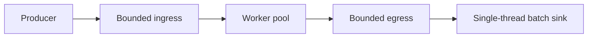

# java-concurrent-pipeline

[](https://github.com/vkyvikas7/java-concurrent-pipeline/actions/workflows/ci.yml)

Concurrent Java pipeline that turns a slow sequential metadata-sync batch into a bounded worker pool, with measured throughput gains.

A catalog sync receives asset-change events (tables, columns, dashboards, models). Each event has to be enriched — classification, owner, lineage — before it can be written to a search index. The enrich step is a blocking call. Doing that call one event at a time makes the batch as slow as `n` times the downstream latency. The concurrent engine overlaps those calls without letting the in-flight set grow without a limit.

Java 17, Spring Boot 3.4, Maven. The pipeline core has no web dependency; Spring exposes it as a CLI benchmark and as `POST /api/v1/sync/run`.

## Install

JDK 17 or newer and Maven 3.8 or newer.

```bash
git clone https://github.com/vkyvikas7/java-concurrent-pipeline.git
cd java-concurrent-pipeline
mvn test
mvn package
java -jar target/java-concurrent-pipeline-1.0.0.jar --cli \
  --pipeline.cli.mode=BOTH \
  --pipeline.cli.items=160 \
  --pipeline.cli.latency-ms=20 \
  --pipeline.cli.workers=8 \
  --pipeline.cli.queue-capacity=32 \
  --pipeline.cli.batch-size=40
```

`mvn test` runs the suite, including the throughput check. `mvn package` writes `target/java-concurrent-pipeline-1.0.0.jar`. The `java -jar` line is a one-shot CLI run: no web server, a sequential-versus-concurrent table, then exit.

## Usage

CLI, using the defaults in `src/main/resources/application.yml`:

```bash
java -jar target/java-concurrent-pipeline-1.0.0.jar --cli
```

`--cli` is shorthand for `--pipeline.cli.enabled=true`. Override a setting with a Spring argument, for example `--pipeline.cli.workers=8`.

HTTP:

```bash
mvn spring-boot:run
```

```bash
curl -s http://localhost:8080/api/v1/sync

curl -s -X POST http://localhost:8080/api/v1/sync/run \
  -H 'Content-Type: application/json' \
  -d '{"mode":"BOTH","itemCount":160,"latencyMillis":20,"workerCount":8,"queueCapacity":32,"batchSize":40,"ordering":"UNORDERED"}'
```

The report fields, demo limits, and the measured before/after numbers are in [Reproduce the benchmark](#reproduce-the-benchmark).

## Problem

The sequential job is correct and easy to read. It is also latency-bound. With a 20 ms lookup, 160 events take about 3.2 seconds and finish near `1000 / 20 = 50` items/sec. The index writer is not the bottleneck. The job spends almost all of its wall clock waiting, one wait at a time.

A useful rewrite has to do four things at once:

- overlap the lookups
- keep the queues bounded so a fast producer cannot exhaust memory
- push back to the caller when workers or the sink fall behind
- show the gain with a clock, in items/sec and wall time, on the same input

## Approach

Both engines call the same `ItemProcessor` and flush successes through the same batch size. The sequential engine is the baseline. The concurrent engine is a fixed pool between two `ArrayBlockingQueue`s.



1. The producer assigns a sequence and `put`s each event. A full ingress queue blocks the producer.
2. Each worker `take`s one event, enriches it, and `put`s a success or a failure. A full egress queue blocks that worker, which stops it from taking more ingress work.
3. One sink thread batches successes and flushes every `batchSize` items, plus a final partial batch. Failures are counted and sampled. They are not written.
4. After the last event, the producer enqueues one poison pill per worker. When every worker has exited, it enqueues one pill for the sink so the final flush happens after the last result.

Unordered mode emits in completion order. Ordered mode holds a reorder buffer until sequence `k` can be committed. Per-item exceptions do not abort the run. A stuck queue, a sink exception, or a lost item does.

`SimulatedLatencyEnricher` sleeps for a configured latency and then applies a deterministic mapping. The sleep stands in for HTTP or gRPC. The mapping is a pure function of the event, so the two engines can be checked for the same multiset of outputs.

The design notes, including the poison-pill sequence and the memory bound, are in [ARCHITECTURE.md](ARCHITECTURE.md).

## Complexity

Let `n` be the number of events, `T` the per-item enrich latency, `w` the worker count, `b` the flush size, and `c` the queue capacity.

| | Sequential | Concurrent, unordered |
| --- | --- | --- |
| Wall clock when enrich dominates | `Θ(n · T)` | `Θ(n · T / w)` plus queue handoff |
| Auxiliary memory | `Θ(b)` | `Θ(c + b + w)` |
| Order | input order | completion order |

Items/sec is `succeeded / wallClockSeconds`. Failures stay in the denominator's clock and out of the numerator. Ordered mode adds a reorder map whose worst case is `Θ(n)` when an early sequence finishes last. The input list itself is `Θ(n)` in both engines; the queues are what stay flat as `n` grows.

Worked example at `T = 20 ms`, `w = 8`: sequential throughput is about `50` items/sec. Eight overlapping waits land near `400` items/sec if the pool stays busy and the sink keeps up.

## Reproduce the benchmark

Requirements: JDK 17 or newer, Maven 3.8 or newer.

```bash
mvn test
```

`ThroughputBenchmarkTest` warms both engines, then times 160 items at 20 ms of simulated lookup with 8 workers. It prints one line and fails if the concurrent engine is under 3x the sequential wall clock (the ideal ratio is 8x; 3x is the floor used so a noisy shared runner still passes).

Example from a Linux run of that test (JDK 21 executing Java 17 bytecode):

```text
BENCHMARK items=160 latencyMs=20 workers=8 sequentialMs=3223 concurrentMs=403 sequentialItemsPerSec=49.64 concurrentItemsPerSec=397.21 speedup=8.00
```

| Engine | Wall clock | Throughput |
| --- | ---: | ---: |
| Sequential | 3223 ms | 49.64 items/sec |
| Concurrent (8 workers) | 403 ms | 397.21 items/sec |
| Speedup | 8.00x | 8.00x |

Absolute milliseconds move with the host. The ratio is the result that matters, and `mvn test` checks it.

The same shape of run from the packaged CLI (no JUnit):

```bash
mvn -q -DskipTests package
java -jar target/java-concurrent-pipeline-1.0.0.jar --cli \
  --pipeline.cli.mode=BOTH \
  --pipeline.cli.items=160 \
  --pipeline.cli.latency-ms=20 \
  --pipeline.cli.workers=8 \
  --pipeline.cli.queue-capacity=32 \
  --pipeline.cli.batch-size=40
```

`--cli` is shorthand for `--pipeline.cli.enabled=true`. The process skips the web server, prints the table, and exits. `BOTH` runs sequential first, then concurrent, so the process lasts about the sum of the two clocks.

One run of that command:

```text
engine        workers    items       ok     fail    wall_ms    items/sec     blocked_in ingress_hw
SEQUENTIAL          1      160      160        0       3227        49.58              0          0
CONCURRENT          8      160      160        0        406       394.21             76         32
speedup (sequential_wall / concurrent_wall): 7.95x
```

`blocked_in` counts submissions that observed a full ingress queue. `ingress_hw` stayed at the capacity of 32.

HTTP, for a long-lived demo:

```bash
mvn spring-boot:run
```

```bash
curl -s http://localhost:8080/api/v1/sync

curl -s -X POST http://localhost:8080/api/v1/sync/run \
  -H 'Content-Type: application/json' \
  -d '{"mode":"BOTH","itemCount":160,"latencyMillis":20,"workerCount":8,"queueCapacity":32,"batchSize":40,"ordering":"UNORDERED"}'
```

The JSON report includes `wallClockMillis`, `itemsPerSecond`, `blockedIngressSubmissions`, both queue high-watermarks, and up to five sample assets. Omit the optional fields to use the defaults: 8 workers, queue capacity `workers * 4`, batch size 64, unordered. Limits on the demo endpoint: 20,000 items, 200 ms latency, and an estimated stage under 120 seconds (`itemCount * latencyMillis` for sequential, that product divided by workers for concurrent). A second call while a run holds the single permit returns **429**.

## Tradeoffs

- **Overlap versus order.** Unordered mode keeps extra memory on the order of the queue. Ordered mode can buffer every completed item while it waits for sequence 0. The benchmark uses unordered mode because the index load in this job does not need global order.
- **Pool size versus the downstream service.** Eight blocking calls is enough to hide a 20 ms lookup. A much larger pool raises concurrency on the metadata service and on the sink. The queue, not the pool, is the safety bound; raising workers without raising capacity still blocks the producer once `c` items are sitting in ingress.
- **Queue capacity versus latency.** A larger queue absorbs bursts and adds residence time. A capacity of `workers * 4` keeps the pool busy without holding a large backlog. The blocked-put counter is the signal that the bound was hit.
- **Batch size versus freshness.** Larger batches cut flush calls. They also delay the first visible write. The sink thread is single-threaded, matching a writer that is not safe for concurrent calls.
- **Block versus drop.** A full queue blocks. The run fails only when the block lasts longer than `runTimeout` (10 minutes for the demo service). Dropping would make the items/sec number look better and the catalog wrong.
- **Exactly-once inside one process.** Each event is taken by one worker. The pipeline does not dedupe source ids, and a crash after a flush still needs an idempotent sink if the batch is retried.
- **Item failure versus run failure.** One enrich error is counted and the rest continue. A sink exception fails the run and is not retried here.
- **Single flight on the demo API.** One comparison at a time keeps the before/after numbers from sharing the CPU. A production scheduler would use its own admission control.
- **What this measurement is.** The clock includes queue handoff and batching, and the processor is a sleep plus a pure mapping. That matches I/O-bound enrichment. It is a poor model of a tight CPU loop; a CPU-bound stage would scale with cores until it saturated, and a nanosecond microbenchmark would want JMH. Sleeps of tens of milliseconds do not.

## Tests

`mvn test` covers:

- exact once-delivery of 10,000 items across 8 workers
- the same success multiset as the sequential engine, including isolated failures
- ordered commit, including a failure that must not stall later sequences
- a single sink thread
- backpressure: a stalled sink makes the producer observe a full ingress queue, then every item is still delivered
- timeout when the sink never unblocks, with the worker threads released
- the REST contract, defaults, and validation
- the CLI runner on startup
- the throughput floor above

## Layout

```text
src/main/java/dev/pipeline/metasync
├── MetadataSyncApplication.java
├── api/            REST
├── cli/            one-shot benchmark
├── domain/         AssetEvent, EnrichedAsset
├── enrich/         simulated metadata lookup
├── pipeline/       sequential engine, bounded worker pool
├── service/        comparison and reports
└── source/         deterministic events
```

## License

[MIT](LICENSE).
